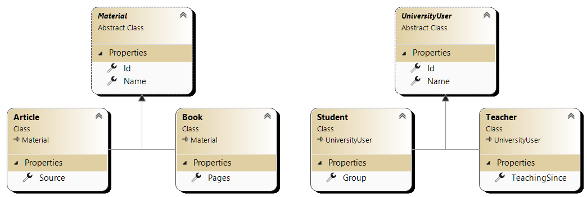
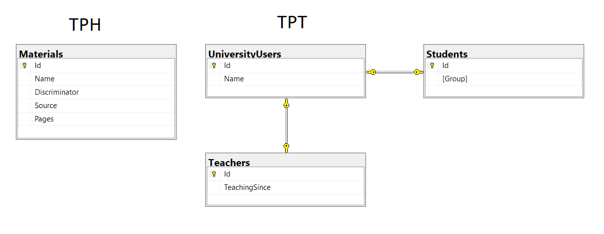

# Task 1

## Task details

Using Entity Framework Core write an app that shows how TPH and TPT works.

>Використовуючи Entity Framework Core написати програми для імітації наслідування на основі підходів TPH та TPT.
Предметна область - за власним вибором

## Project structure

### Project layers

This project consists of 3 layers:

* WEB – ASP .NET Core application
* BL – business logic, contains services for DB access and mapping profile
* DAL – data access layer

I used my older project as a template and removed most of it's functionality.
BL and WEB layers were simplified, so there's no error handling. Services are all the same.

So you can expect the application to crash when accessing wrong items.

### Classes

For TPH these classes were created:

* [Material](Task1.DAL/DomainModels/TPH/Material.cs) - abstract class
* [Book](Task1.DAL/DomainModels/TPH/Book.cs)
* [Article](Task1.DAL/DomainModels/TPH/Article.cs)

For TPT:
* [UniversityUser](Task1.DAL/DomainModels/TPT/UniversityUser.cs) - abstract class
* [Student](Task1.DAL/DomainModels/TPT/Student.cs)
* [Teacher](Task1.DAL/DomainModels/TPT/Teacher.cs)

Class diagram:



## DB structure

The image below was created in Microsoft SQL Management Studio.



## Connection to DB

I used MSSQL LocalDB.

Connection string is located in [appsettings.json](Task1.WEB/appsettings.json):

```
Server=(localdb)\\MSSQLLocalDB;Database=Task1.DatabaseContext;MultipleActiveResultSets=True
```

To create a DB from migrations, use this command:

```shell
dotnet ef database update --project .\Task1\Task1.DAL\ --startup-project .\Task1\Task1.WEB\
```

## Error handling

I had to recreate my LocalDB due to some connection errors:

```shell
SqlLocalDB stop MSSQLLocalDB -k
SqlLocalDB delete MSSQLLocalDB
SqlLocalDB create MSSQLLocalDB -s
```